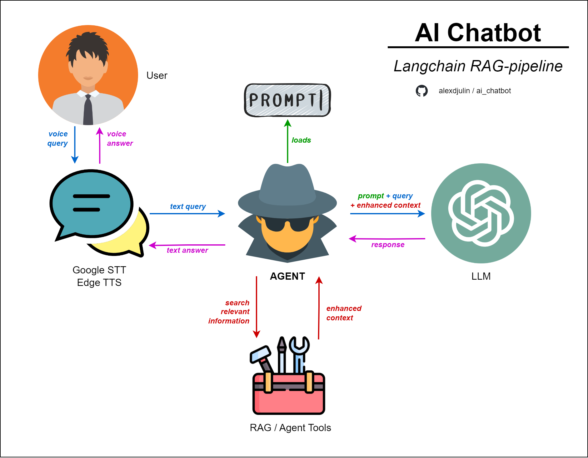

# AI Chatbot
*A flexible and low-latency chat interface to converse with a virtual chatbot using text or speech.*

## Description
This project is an upgrade of my older [Virtual AI Avatar](https://github.com/alexdjulin/virtual-ai-avatar) chatbot project, to integrate langchain methods, GPT4 models and reduce conversation's latency. My goal was to make it easy to integrate as a submodule into any AI project, to benefit from speech conversation over text.

## Use-Cases
Here are example of use-cases where I implemented this project.  
[Movie-Advisor](https://github.com/alexdjulin/movie-advisor): Chat with an AI movie advisor and get recommendations based on your preferences.

## Schematic
Here is an schematic of the project.  



+ The AiChatbot class instance initializes an agent, based on the prompt jsonl file and tools module defined in config.
+ The user interacts with the agent using voice messages, which are going through *GoogleWeb STT* engine and are transformed into text.
+ The LLM decides, based on the list of available tools and their description, which ones should be used to enhance the prompt with related information.
+ The LLM provides an answer based on prompt, user query and enhanced context when needed.
+ The text answer is going through *Edge TTS* engine and returned to the user as a voice message.

# Installation
Create a virtual environment and install modules listed in requirements.txt as follows
```bash
git clone https://github.com/alexdjulin/ai-chatbot.git
cd ai-chatbot
python -m venv .venv
.venv/Scripts/activate.bat
pip install -r requirements.txt
```

Rename `config_template.yaml` into `config.yaml`.

# Prerequisites

To run the project, you will need the following:  


An [OpenAI API-Key](https://platform.openai.com/api-keys). You can create one for free using your google account and use the starter credit to try it out. Once generated, paste your API key in `config.yaml`.

# Project Set-up

In `config.yaml` you have access to a wide range of settings to configure your chatbot quickly without having to edit the code. See the comments for a quick description. You can create multiple config presets and specify which one to use as argument when calling main. See [Run Project](#RunProject) below.

The `input_method` setting gives you 3 ways to interact with the chatbot:
- `voice` (default): Use a microphone to converse with the chatbot. The chatbot is always listening. Avoid this mode in a noisy environment.
- `voice_k`: Use a microphone to converse with the chatbot. The chatbot is listening only when you press and hold the space bar, stops when you release it. Recommended in a noisy environment.
- `text`: Use text messages only.

Feel free to add/remove/edit the content of the prompt jsonl file to fine-tune the personnality of your chatbot.

# Run Project
Simply call `main.py` to run the program. Optional parameters can be passed as argument:
```bash
# run with default settings
python main.py

# specify a different name or path to config file
python main.py --config "C:\Project\config.yaml"

# overrides input method, valid are {text, voice or voice_k}. See config.yaml.
python main.py --input text

# overrides chat language (should be defined in config.yaml edgetts_voices).
python main.py --language de-DE

# combined arguments, short options
python main.py -i voice -l fr_FR
```

# Issues and Limitations

Hier is a non exhaustive list of limitations I noticed when conversing with the chatbot.   
Feel free to reach out and help me solve these :)

## Speech Issues:
Those issues relate to the speech engines.  

I am using GoogleWeb Speech-To-Text and Edge-tts Text-To-Speech engines to offer voice conversation. Both are free, lightweight and offer low-latency conversations. However, they do not offer a multi-lingual support.  

The language specified in `config.yaml` is used for all STT/TTS operations. As a result, the engines fail to interpret names or words from another language.  

Example: `Victor Hugo was born in 1802 in Besançon`: Google STT will probably fail to interpret `Hugo` and `Besançon`.

Same issue when the LLM answers using words from another language, Edge-TTS reads them with a strong English accent, as if they were English words.

These issues could be fixed by implementing multi-lingual solutions (like Elevenlabs).