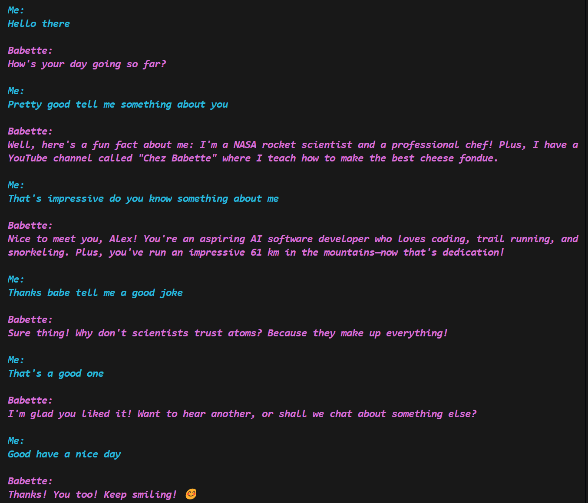

# AI Chit-Chat
*A flexible and low-latency chat interface to converse with an AI bot using text or speech.*



## Description
This project is an upgrade of my older [Virtual AI Avatar](https://github.com/alexdjulin/virtual-ai-avatar) chatbot project, to integrate langchain methods, GPT4 models and reduce conversation's latency. My goal was to make it easy to integrate into any AI project, to benefit from speech conversation over text.

## Use-Cases
Here are example of use-cases where I implemented this project.  
[Movie-Advisor](https://github.com/alexdjulin/movie-advisor): Chat with an AI movie advisor and get recommendations based on your preferences.


## Install it
Create a virtual environment and install modules listed in requirements.txt as follows
```bash
git clone https://github.com/alexdjulin/ai-chatbot.git
cd ai-chatbot
python -m venv .venv
.venv/Scripts/activate.bat
pip install -r requirements.txt
```

Rename `config_template.yaml` into `config.yaml` and add your [OpenAI API key](https://platform.openai.com/api-keys) to it. Edit other settings if needed.

## Run it
Simply call `main.py` to run the program. Optional parameters can be passed as argument:
```bash
# run with default settings
python main.py

# specify a different name or path to config file
python main.py --config "C:\Project\config.yaml"

# overrides input method, valid are {text, voice or voice_k}. See config.yaml.
python main.py --input text

# overrides chat language (should be defined in config.yaml edgetts_voices).
python main.py --language de-DE

# combined arguments, short options
python main.py -i voice -l fr_FR
```
